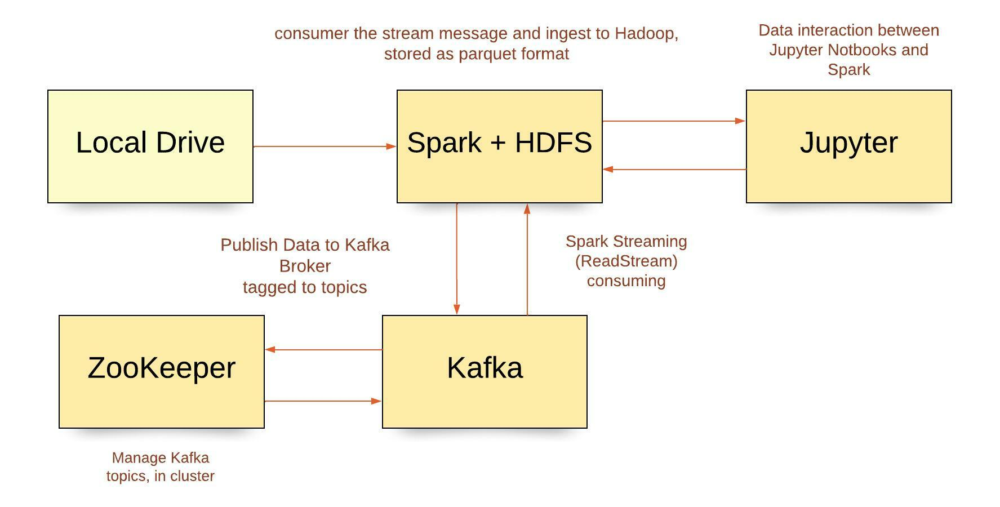

# IS405.M21 Big Data


## Motivation
In this project, I'm going to build an end to end data pipeline starting with data streaming from `MilionSong Dataset` to `Kafka cluster`. There will be a `Spark streaming` application to consumer the stream message and ingest to `Hadoop`, stored as parquet format, and retrieved with `Spark SQL` via `Jupyter`. There is another Spark Batch job to run the model after the experiment on Jyputer. The experiment focuses on the analyze and predict the factors impacting to churn rate. 

The data pipeline looks as below:

<p align="center">
    
</p>

## Dataset
- This is a public dataset named Million Song Dataset and can be download under json format from <a href="./data/medium-sparkify-event-data.json.gz">here</a>

- Contains 18 columns which has the information of customers(gender, name, etc.) and API events(login, playing next song, etc.)
- Experiment period: 2018–10–01 to 2018–12–01
- Kafka message example:
```
{
    "ts":1543621857000,
    "userId":"300011",
    "sessionId":500,
    "page":"NextSong",
    "auth":"Logged In",
    "method":"PUT",
    "status":200,
    "level":"paid",
    "itemInSession":37,
    "location":"New York-Newark-Jersey City, NY-NJ-PA",
    "userAgent":"Mozilla/5.0 (compatible; MSIE 9.0; Windows NT 6.1; WOW64; Trident/5.0)",
    "lastName":"House",
    "firstName":"Emilia",
    "registration":1538336771000,
    "gender":"F",
    "artist":"Olive",
    "song":"You\\'re Not Alone",
    "length":264.12363
}
```
## Setup prerequisites
Set up enviroment with Docker
```
docker-compose up -d
```

Install library with Conda
```
conda create --name bigdata --file requirements.txt
conda activate bigdata
```


## Project File
The main project files and their respective functions listed as below:
```
├───data
│   └───medium-sparkify-event-data.json.gz
├───notebooks
|   └───pyspark.ipynb
├───app.cfg
├───logging.ini
├───deploy.sh
├───kafka_consumer.py
├───kafka_producer.py
├───producer_server.py
├───spark_streaming.py
```
- logging.ini: the config for logging of Spark applications
- app.cfg: list out parameters used in the application (specific for Kafka and Spark).
- kafka_producer.py: kafka producer script to send the kafka message
- producer_server.py: kafka core service which is to parse the json file and produce by Confluence Producer class
- kafka_consumer.py: kafka consumer script used for testing the message sent by kafka_producer.py
- spark_streaming.py: the Spark streaming application which consumes message from Kafka, transform and store on HDFS
- medium-sparkify-event-data.json.gz: json data should be unzip when start testing.
- deploy.sh: shell script to quicly deploy the Spark application to our Yarn cluster.

## How to run ??
How to run the Kafka producer:

- Extract the `medium-sparkify-event-data.json.gz` in data folder
- Run python `kafka_producer.py --time_interval 1` to send every message per second

How to run Spark streaming application:

- At the current project, run `./deploy` script
- It will submit our pyspark application to Yarn cluster and start consume message sent from Kafka.

## Result Summary
- The business problem to solve: predict churn rate

